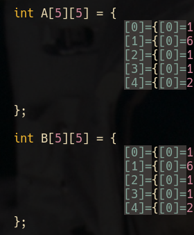
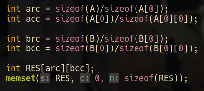
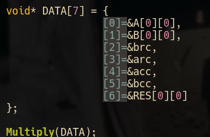
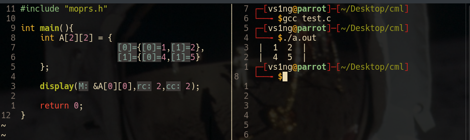

# MOprs : Multi-Threaded Matrix Operations 
## MOprs is a multi-threaded matrix operations library that I, Vinayak Singh, made from ground up.

| File | Type | Category | 
| ---- | ---- | -------- |
| moprsth.c | Main Header file | Threaded Operations |
| moprsnth.c | Old Header file | Non-threaded operations |

## Features:

| S.No. | Operation |
| ----- | --------- |
| 1 | Display Matrices |
| 2 | Multi-Threaded Multiplication |
| 3 | Multi-Threaded Addition |
| 4 | Multi-Threaded Subtraction |
| 5 | Multi-Threaded Scalar Multiplication |

## 1. Multi-Threaded Algebra 
### This method is fixed for:

* Addition
* Subtraction
* Multiplication 

| Operation | Function Name |
| --------- | ------------- |
| Multiplication | Multiply() |
| Addition | Add() |
| Subtraction | Sub() |

1. Define both Matrices

What it looks like: 



2. Define row, column counts along with a resultant matrix. 

```
memset(RESULTANT, 0, sizeof(RESULTANT)):
```
What it looks like :



3. Define an array containing the addresses of the variables in the following manner:

```
void* DATA[7] = { 
                    &A1[0][0],
                    &A2[0][0],
                    &A2_RowCount,
                    &A1_RowCount,
                    &A1_ColCount,
                    &A2_ColCount,
                    &Resultant[0][0]
};
```

What it looks like : 



4. Call Operation() on the above array.

```
Multiply(DATA);
Add(DATA);
Sub(DATA);
```


## 2. Scalar Multiplication
### k*A st. k = Integer, A = MxN matrix
### This operation requires a different structure for the input DATA array.

```
void* DATA[5] = {
                    &Array[0][0],
                    &ResultantArray[0][0],
                    &VariableStoring_K_the_integer,
                    &ArrayRowCount,
                    &ArrayColCoun
};
```

Then:

```
ScalarMul(DATA);
```

## 3. Display()

* Import the library and call the display function :)

```
#include "moprs.h"
...
    display(&PointerToFirstElement,RowCount,ColumnCount);
...
```

What it looks like: 


