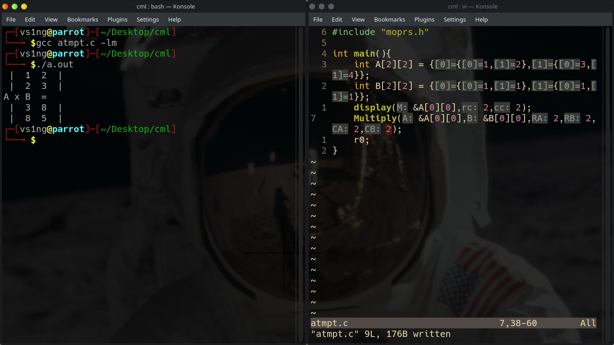
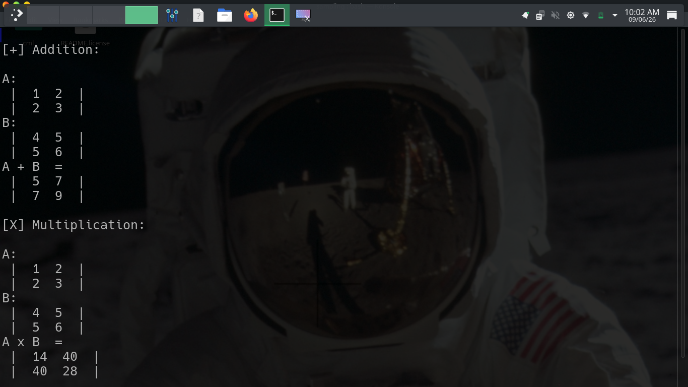
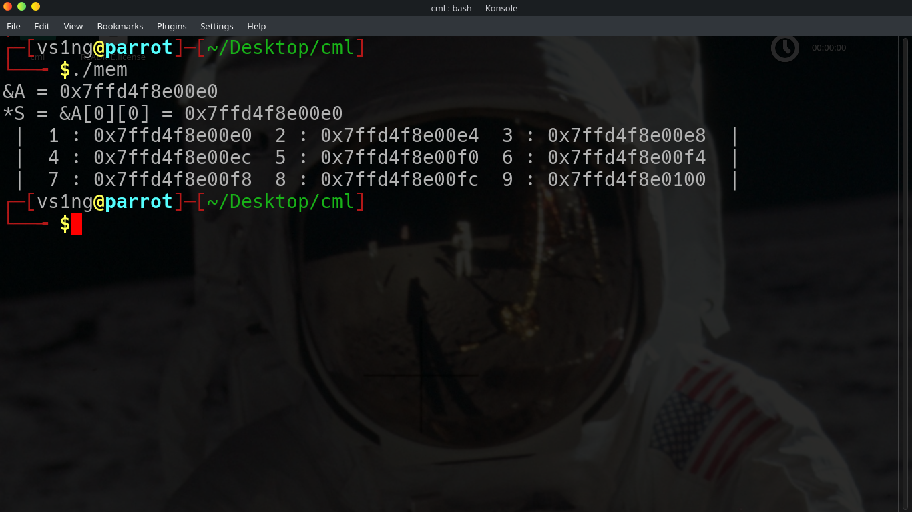

# MOprs : Matrix Operations 
## MOprs is a matrix operations library that ME I VINAYAK SINGH made from scratch
### Features:

1. Matrix Multiplication
2. Addition
3. Subtraction
4. Scalar Multiplication

### Usage:

#### Simply import the header (.h) file and pass in arguements as described 

```
Function(Pointer to Array, Row size, Col. size)
```

e.g : 



#### Demo of Addition and Multiplication:



#### Memory Address Mapping on x86 64-bit UNIX systems


